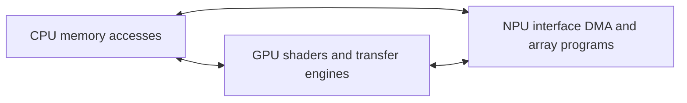

# CPU, GPU and NPU interop

CPU, GPU and NPU programs exchange payloads through memory and exchange
ownership through synchronization. An edge has a producing operation, a
memory path, a dependency and a consuming operation. The producer's release
and the consumer's acquire cover that path; completion and final use determine
when its storage becomes available again. NPU here means an XDNA AI Engine
array, including the interface DMA which connects external memory to its
local dataflow.

These arrows name programming flows, not a claim of coherent peer access on
every device. A particular edge can use shared backing, an explicit copy or
staging. The host can relay completion without copying the payload. The
[external-memory chapter](external-memory.md) separates those choices from
handle import and native addressability.

## The six directed handoffs

| Direction | Producer publication | Consumer entry | Reuse boundary and complete recipe |
| --- | --- | --- | --- |
| CPU → GPU | Finish host writes and their CPU mapping's store/cache operations before publishing dependent GPU work. | Packet or shader acquire through the GPU mapping that reaches those writes. | The last GPU read, including an upload transfer if it creates a separate local copy. [CPU/GPU flow](../gpu/recipes/host-device.md). |
| GPU → CPU | Join the producing shader or transfer and release output to its CPU-visible path before publishing completion. | Successful completion observation, host acquire and the mapping's CPU access/invalidation operation. | The last CPU reader as well as other device readers. [GPU readback](../gpu/recipes/host-device.md#cpu-publication-and-device-cache-operations). |
| CPU → NPU | Publish instruction and input bytes through the actual host-cache contract before their controller or MM2S read. | A finite submission dependency or the resident program's input-ready protocol, followed by DMA into local storage. | The last external-source DMA read; local copies can remain live longer. [Host-to-array flow](cpu-npu.md). |
| NPU → CPU | Complete the S2MM output transfer and accesses covered by the reported result. | Successful native result or an established per-record completion, then CPU cache acquisition. | The last CPU reader, separately from resident program shutdown. [Array-to-host flow](cpu-npu.md). |
| GPU → NPU | Join all GPU contributors and release to the external DMA observation point before input-ready publication. | NPU input admission after that dependency, then external MM2S read. | Every NPU reader of that source version. [GPU/array flow](../gpu/recipes/gpu-npu.md#a-finite-gpu--array--gpu-sequence). |
| NPU → GPU | Complete the output writes at the GPU's observation point before publishing their completion. | A GPU dependency followed by acquisition of the payload's cache path. | Every consuming GPU wave or transfer, and any additional readers. [Array/GPU flow](../gpu/recipes/gpu-npu.md#resident-programs-and-per-generation-ownership). |

For a finite invocation, native completion can carry the dependency between
actors. A resident program instead supplies a new dependency for each record;
the dispatch's initial acquire and final release do not occur anew on each
iteration. A local array lock or transfer token retains its own hardware
meaning. The [output publication discussion](../gpu/recipes/gpu-npu.md#output-dma-and-a-ready-flag)
identifies the external response, observation and access-width premises needed
to make a resident flag a complete device-to-device handoff.

## What belongs to an edge

| Property | Information it supplies |
| --- | --- |
| Backing and placement | Which bytes are shared or copied; system DRAM, GPU-local memory and array-local SRAM remain distinct. |
| Address and range | Each actor's address, accessible extent, export/binding offset, alignment and native mapping lifetime. Numeric address equality is unnecessary. |
| Cache path | CPU mapping, GPU memory type and caches, external DMA attributes, and the observer reached by release/acquire. |
| Control path | The ready/completion value, its writer, access width, cache behavior and generation. A control cell can have a different path from the payload. |
| Execution dependency | Which producer accesses have ended before which consumer accesses begin. |
| Final use | Every reader, writer, command fetch and control waiter that still owns the storage or mapping. |

The [CPU/GPU mapping recipe](../gpu/recipes/host-device.md#mapping-properties-describe-different-things)
and [CPU/NPU cache contract](cpu-npu.md) give concrete native examples. GPU
SYSTEM scope describes observers in a memory model; it is not a synonym for
system DRAM or an automatic coherency grant to an imported NPU mapping.

The cache-maintenance extent also participates in ownership. A logical buffer
slice, CPU cache line, native mapping page and backing object can have
different boundaries. Two byte-disjoint slots can still interact when one
owner flushes a page or an entire imported allocation. The native operation's
actual granule, not just the caller's requested byte count, determines which
concurrent access patterns are possible. [Host/array maintenance](cpu-npu.md)

## Composing the mechanisms

| Subject | Reference |
| --- | --- |
| Shared allocation setup and external APIs | [External memory and synchronization](external-memory.md): DMA-BUF, Vulkan, Windows and D3D12 ownership. |
| Whole graphs and resident rings | [Heterogeneous pipelines](pipelines.md): finite completion, per-generation credits, split/join, progress, drain and timing. |
| GPU upload, compute and readback | [Engine composition](../gpu/recipes/README.md#sdma-upload-aql-dispatch-and-sdma-download), [local-memory staging](../gpu/recipes/local-memory.md), and [PM4/SDMA handoffs](../gpu/recipes/pm4-sdma.md). |
| Peer GPU movement | [Peer-agent handoff](../gpu/recipes/host-device.md#peer-gpu-handoff): direct access, copy routes, directed pool access and per-device cache scopes. |
| Tile-to-tile and one-to-many dataflow | [Array DMA](../xdna/dma.md) and [interconnects](../xdna/interconnects.md), including memory locks, streams, multicast and buffer joins. |
| Command and executable publication | [AQL](../gpu/aql/publication.md), [PM4](../gpu/pm4/publication.md), [SDMA](../gpu/sdma/publication.md), and [XDNA execution](../xdna/execution.md). |
| Clock and event interpretation | [GPU observation](../gpu/observability.md) and [array observation](../xdna/observability.md). |

The same reasoning extends to two GPUs or two NPU devices, with a separate
mapping and directed access contract for each device. Two queues on one GPU,
two tiles in one array and two physical devices have different coherence and
progress premises. An array-local route does not extend across a device
boundary; that edge returns to the external-memory protocol.
