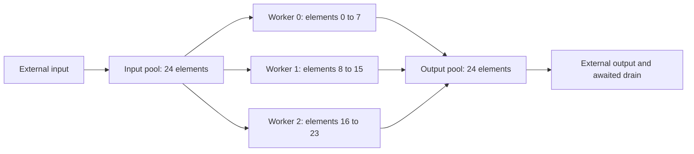

# AI Engine interconnects

AI Engine stream switches move data between tile cores, DMA engines and
neighboring switches. A circuit route connects one source to configured
destinations; a packet route selects destinations from a header. The switches
provide flow control and replication, while the endpoints own the buffers and
the computation. A split, join or broadcast in a compiler dataflow graph must
be resolved into those native resources. [Stream-switch architecture][am020-stream]
[Object-fifo route lowering][fifo-flows]

## Architecture and native target

The architecture manuals distinguish the stream datapaths:

| Architecture manual | Switch datapath and packet boundary |
| --- | --- |
| Versal AIE-ML, AM020 revision 1.5 | 32-bit data words, parity and `TLAST`; one 16-entry stream FIFO. |
| Versal AIE-ML v2, AM027 revision 1.1 | 64-bit data beats carrying two 32-bit words, two parity bits, `TLAST` and an internal one-bit `TKEEP`; one 16-entry stream FIFO. Core, trace and control interfaces use 32-bit adapters. With `TLAST=1, TKEEP=0`, only one 32-bit word in the final beat is valid. |

These are the named Versal architecture contracts. The selected native target
supplies tile geometry, port availability and configuration addresses. In
MLIR-AIE's NPU configuration backend, `AIE2` selects `XAIE_DEV_GEN_AIE2IPU`
and `AIE2p` selects `XAIE_DEV_GEN_AIE2P_STRIX_B0`; the backend constructs the
driver configuration from that target model and partition. A shared stream
programming model does not make Versal's system interfaces or register
addresses interchangeable with a Ryzen device. [AM020 stream datapath][am020-stream]
[AM027 stream datapath][am027-stream] [Native target selection][native-target]

The internal one-bit `TKEEP` differs from the byte-valid mask at the
Versal PL-facing AXI4-Stream interface. For 64-bit streams from PL with
`TLAST=1`, AM027 permits `0x0f` or `0xff` for 32-bit or 64-bit valid data.
With `TLAST=0`, that interface ignores `TKEEP` and assumes all bytes valid.
The two representations express 32-bit granularity at different interfaces.
[PL interface representation][am027-interface]

## Ports and circuit routes

An input port carries data **into** a switch; an output carries data **out of**
it. Driver names `Slave` and `Master` follow those directions. For example, a
tile's MM2S DMA produces data at a switch input, while its S2MM DMA receives
data from a switch output. North and south name the neighboring connection,
not a DMA direction. [Circuit builder][circuit-builder]
[DMA endpoint construction][fifo-endpoints]

The AIE2P driver tables contain these port counts. They describe the switch
blocks; placement at an array or partition boundary still constrains which
neighboring connection is usable. [Compute and shim ports][aie2p-ports]
[Memory-tile ports][aie2p-memory-ports] [Target connections][target-connections]

| Port bundle | Compute inputs / outputs | Memory-tile inputs / outputs | Shim inputs / outputs |
| --- | --- | --- | --- |
| Core | 1 / 1 | 0 / 0 | 0 / 0 |
| DMA | 2 / 2 | 6 / 6 | 0 / 0 |
| Control | 1 / 1 | 1 / 1 | 1 / 1 |
| Stream FIFO | 1 / 1 | 0 / 0 | 1 / 1 |
| South | 6 / 4 | 6 / 4 | 8 / 6 |
| West | 4 / 4 | 0 / 0 | 4 / 4 |
| North | 4 / 6 | 4 / 6 | 4 / 6 |
| East | 4 / 4 | 0 / 0 | 4 / 4 |
| Trace | 2 / 0 | 1 / 0 | 1 / 0 |

The shim's zero direct DMA entries do not mean that it lacks DMA. A separate
shim mux connects DMA to the switch's south side. The cited MLIR-AIE path
finder uses switch south inputs 3 and 7 for shim MM2S channels 0 and 1, and
south outputs 2 and 3 for S2MM channels 0 and 1. Its mux uses a north-facing
name for the connection back to that same shim tile's switch. The backend
emits the corresponding shim-DMA mux APIs. [Shim route construction][shim-routes]
[Shim mux programming][shim-programming]

`XAie_StrmConnCctEnable` resolves the logical source to a physical input-port
index, checks the tile's legal connection predicate, configures the output
to select that input in circuit mode, and enables the input. Several outputs
can select the same input to form multicast. Each output still has one
circuit source. AIE2P uses the AIE-ML connection checks: examples include
matching-channel DMA loopback, no core-to-core connection inside one switch,
and restricted trace destinations. Port existence alone therefore does not
establish a legal route. [Circuit register writes][circuit-builder]
[AIE2P validation callbacks][aie2p-switch-properties]
[Legal compute connections][legal-connections]

Circuit multicast sends the source data to every configured destination.
Backpressure propagates toward the source when downstream capacity is
insufficient; adding a destination can therefore constrain the other
branches. Branch buffering provides finite slack, while pressure from the
recipients still constrains their common source. Packet switching permits
logical streams to share a physical port,
with arbitration and potentially variable latency. These properties do not
establish a completion or memory-visibility observation at the endpoints.
[Circuit and packet flow control][am027-stream]

## Packet representation and selection

The first 32-bit word carries the packet header. The following layout is
specified by UG1079 2024.1 and the AM020/AM027 stream chapters. `TLAST` marks
the final packet word; on the AM027 datapath, `TKEEP` also identifies a final
half beat. [Packet header][packet-header] [Packet boundaries][am020-stream]

| Header bits | Meaning |
| --- | --- |
| `4:0` | Packet or stream ID. |
| `11:5` | Zero. |
| `14:12` | Packet type. |
| `15` | Zero. |
| `20:16` | Source row. |
| `27:21` | Source column. |
| `30:28` | Zero. |
| `31` | Odd parity for the lower 31 bits. |

Routing uses configured ID matches, rather than interpreting source row and
column as a destination address. The native slave-slot builder writes a
five-bit ID and mask, an enable bit, an arbiter and a master-select value.
It does not match the packet-type field. AIE2P's compute, memory and shim
switch tables each provide four rule slots per input, spaced four bytes apart
within a 16-byte slot group. [Packet-rule builder][packet-rule-builder]
[AIE2P rule-slot properties][aie2p-switch-properties]

AM025 revision 1.2 provides a concrete **Versal AIE-ML** register example.
`Stream_Switch_Master_Config_DMA1` is a 32-bit register at tile-relative byte
offset `0x3f008`; `Stream_Switch_Slave_AIE_Trace_Slot2` is at `0x3f378`.
Their documented reset values are zero. The field names describe the two
sides of packet selection; the addresses belong to this register manual.
[Output register][master-register] [Input rule register][slot-register]

| Register | Bits | Meaning |
| --- | --- | --- |
| Output configuration | `31`, `30` | Output enable and packet-mode enable. |
| Output configuration | `7` | Drop packet header at this output; ignored in circuit mode. |
| Output configuration, circuit mode | `4:0` | Selected physical input port. |
| Output configuration, packet mode | `2:0`, `6:3` | Arbiter and four-bit master-select enable mask. |
| Input packet-rule slot | `28:24`, `20:16` | ID and mask; mask bit one participates in comparison. |
| Input packet-rule slot | `8`, `5:4`, `2:0` | Rule enable, master select and arbiter. |

The rule's arbiter and master select identify an output group. Outputs on
that arbiter enable the relevant master-select bit; enabling it on several
outputs forms packet multicast. The MLIR-AIE router allocates six arbiters
with four master selects apiece, keeps each output associated with one
arbiter, and assigns a multicast destination set a common arbiter/select
pair. The driver's three-bit arbiter argument is an encoding bound; it is
not evidence that this compiler allocates eight arbiters. The cited
allocation policy specifies resource assignment, not a fairness bound or a
global packet order between independent sources. [Compiler arbiter allocation][arbiter-allocation]
[Multicast grouping][packet-multicast] [Native output configuration][packet-master]

The native backend keeps packet headers by default, drops them at DMA
destinations and at row-zero south outputs assumed to lead to shim DMA, and
honors an explicit `keep_pkt_header` override. Consequently a DMA buffer's
layout depends on whether the route strips the header. For an object-fifo
packet flow, lowering assigns the source descriptor a packet type and ID;
the switch rules then route that stream. [Header handling and slot emission][packet-programming]
[Source descriptor packet selection][fifo-packet]

## Streams, neighboring memory and cascade

Three communication mechanisms can connect nearby tiles, with different
owners:

| Mechanism | What moves and what selects the path |
| --- | --- |
| Stream switch | Words and packet boundaries; switch configuration and endpoint ready/valid flow control select and pace the route. |
| Neighboring memory | A load/store or DMA accesses an addressable neighboring memory bank; address reach and memory locks establish buffer ownership. No stream route is implied. |
| Cascade | Accumulator data uses a separate core cascade connection. MLIR-AIE lowers cascade flows separately and programs accumulator-control routing. |

AM020 describes the neighboring-memory and cascade paths separately from its
stream crossbar. The driver port table makes a useful distinction concrete:
memory tiles have north/south stream ports but no east/west stream ports,
even where their DMA engines can address neighboring memory tiles. The
MLIR-AIE backend's cascade configuration invokes
`XAie_CoreConfigAccumulatorControl`, separately from stream-switch connects.
[Architecture paths][am020-array] [Memory-tile communication][am020-memory]
[Memory-tile stream ports][aie2p-memory-ports]
[Cascade lowering][cascade-lowering] [Cascade programming][cascade-programming]

A compiler can also lower a reachable object-fifo edge to shared memory
instead of DMA. Its source checks placement, consumer count, transforms and
explicit route choices. A high-level FIFO edge therefore does not by itself
prove that the program uses a stream link. [Shared-memory versus DMA selection][fifo-dma-selection]

## A split, compute and join flow

The IRON `distribute_and_join_L2` example transfers 48 `int32` values through
two 24-element objects. Each input object occupies 96 bytes in a memory-tile
pool. The split selects eight-element slices at element offsets `0`, `8`
and `16`, or byte offsets `0`, `32` and `64`. Three workers each add one to
their slice, and a separate output pool joins the three slices into another
24-element object. The runtime fills the input and requests an awaited
output drain. [Complete IRON caller][split-join-caller]

This diagram describes data ownership, not fixed physical tile coordinates.
IRON's split and join default to memory-tile placement and create linked
object fifos with the supplied element offsets. The compiler then performs
the following lowering. [IRON split and join][iron-split-join]
[Native lowering pipeline][fifo-pipeline]

1. The whole-object side determines each linked pool's storage shape. The
   offsets divide it into three segments. The whole-object endpoint covers
   all segments; each slice endpoint covers its selected segment.
   [Pool and segment construction][fifo-pools]
2. For the AIE2 family, each segment gets a produce/consume semaphore-lock
   pair. Produce counts available objects; consume counts populated objects.
   The compiler creates MM2S draining and S2MM filling DMA endpoints, with
   descriptor offsets and lengths derived from those segments.
   [Lock allocation][fifo-locks] [DMA endpoints][fifo-endpoints]
3. Each descriptor acquires its segment's required lock count, transfers the
   slice and releases the corresponding count. Core acquire/release uses
   the same ownership representation. A whole-object drain visits its
   segments; completion of the whole returned object consequently depends
   on every slice, without requiring the three workers to finish together.
   [Descriptor construction][fifo-descriptors] [Core ownership][fifo-core-locks]
4. With ordinary circuit lowering, routes become source/destination flows.
   The path finder assigns legal switch connections and shim mux paths.
   `configureSwitches` turns each connection into
   `XAie_StrmConnCctEnable`. A broadcast route can share one source among
   several destinations; this example instead distributes distinct slices
   through separate endpoint transfers. [Flow construction][fifo-flows]
   [Switch routing][circuit-routing] [Native calls][circuit-programming]
5. Native configuration initializes buffers and locks, programs and queues
   DMA descriptors, then configures the switches. The configuration
   generator enables cores in a separate following phase. The cited
   implementation therefore does not impose a rule that every switch
   register must precede every DMA-channel enable; initial locks and the
   complete program's start sequence participate in safe initialization.
   [Initialization order][native-init] [Configuration caller][native-init-caller]
6. The host transfer task requests a completion token for the waited output.
   IRON emits waits before descriptor frees in that task group. The finite
   output's data dependency passes through all three workers; descriptor
   freeing is bookkeeping after the chosen completion dependency.
   [DMA task emission][dma-task] [Task-group owner][task-group]

The workers perform the `+1` arithmetic. The split is data partitioning and
the join is buffer assembly; neither operation asks the stream switch to
perform a reduction. For input values of one, the caller checks 48 output
values of two. The same mechanism can carry other core computations without
changing what the native route itself does. [Worker and result][split-join-caller]

## Completion and route lifetime

Stream acceptance, packet termination, buffer release and program retirement
have different consumers. `TLAST` terminates a packet. A local object-fifo
release makes the associated object available to its next endpoint. The
awaited shim output establishes the selected task's completion. None of
those events alone says that a resident core has stopped or that a route can
be reconfigured while other producers remain active. The example uses
IRON's default repeating worker: `while_true=True` lowers to a loop with
`sys.maxsize` iterations. Ordinary object-fifo DMA lowering can also loop its
descriptor chain back to the first descriptor and wait for later lock counts.
[Worker default][worker-default] [Worker loop][worker-loop]
[Cyclic descriptor owner][fifo-chain]
[Task-group completion][task-group]

The program retains its switch routes, local pools, locks and descriptor
state for every endpoint which may still use them. Replacing that state
requires quiescing those users through the program's own termination and
native context protocol. `XAie_StrmConnCctDisable` only programs registers;
it has no transfer-drain operation. It also disables the selected source
port, so disabling one named connection is not an isolated live removal of
one multicast branch. [Circuit enable and disable][circuit-disable]
[Native program lifetime](execution.md#placement-and-program-quiescence)

An external CPU or GPU consumer additionally needs the mapping and
completion/visibility protocol of that external memory path. The local
route and lock rules supply no cross-channel guarantee that a second DMA's
ready flag becomes visible only after another channel's payload. Those
observer and lifetime obligations belong to the
[external memory handoff](../gpu/recipes/gpu-npu.md).

[am020-stream]: https://docs.amd.com/r/en-US/am020-versal-aie-ml/AXI4-Stream-Interconnect
[am027-stream]: https://docs.amd.com/r/en-US/am027-versal-aie-ml-v2/AXI4-Stream-Interconnect
[am027-interface]: https://docs.amd.com/r/en-US/am027-versal-aie-ml-v2/AIE-ML-v2-Array-Interface
[packet-header]: https://docs.amd.com/r/2024.1-English/ug1079-ai-engine-kernel-coding/Packet-Processing
[master-register]: https://docs.amd.com/r/en-US/am025-versal-aie-ml-register-reference/Stream_Switch_Master_Config_DMA1-CORE_MODULE-Register
[slot-register]: https://docs.amd.com/r/en-US/am025-versal-aie-ml-register-reference/Stream_Switch_Slave_AIE_Trace_Slot2-CORE_MODULE-Register
[am020-array]: https://docs.amd.com/r/en-US/am020-versal-aie-ml/AIE-ML-Array-Architecture
[am020-memory]: https://docs.amd.com/r/en-US/am020-versal-aie-ml/AIE-ML-Memory-Tile
[native-target]: https://github.com/Xilinx/mlir-aie/blob/41fa359ea1f66f7e5c572f8d0cc8c7646262adf5/lib/Targets/AIERT.cpp#L248-L298
[aie2p-ports]: https://github.com/Xilinx/aie-codegen/blob/2855a032366e3d19dab893e7c263b14bb920cd64/src/global/xaie2pgbl_reginit.c#L212-L386
[aie2p-memory-ports]: https://github.com/Xilinx/aie-codegen/blob/2855a032366e3d19dab893e7c263b14bb920cd64/src/global/xaie2pgbl_reginit.c#L388-L474
[aie2p-switch-properties]: https://github.com/Xilinx/aie-codegen/blob/2855a032366e3d19dab893e7c263b14bb920cd64/src/global/xaie2pgbl_reginit.c#L1341-L1438
[target-connections]: https://github.com/Xilinx/mlir-aie/blob/41fa359ea1f66f7e5c572f8d0cc8c7646262adf5/lib/Dialect/AIE/IR/AIETargetModel.cpp#L882-L1030
[legal-connections]: https://github.com/Xilinx/aie-codegen/blob/2855a032366e3d19dab893e7c263b14bb920cd64/src/stream_switch/xaie_ss_aieml.c#L52-L109
[circuit-builder]: https://github.com/Xilinx/aie-codegen/blob/2855a032366e3d19dab893e7c263b14bb920cd64/src/stream_switch/xaie_ss.c#L604-L677
[circuit-disable]: https://github.com/Xilinx/aie-codegen/blob/2855a032366e3d19dab893e7c263b14bb920cd64/src/stream_switch/xaie_ss.c#L652-L736
[shim-routes]: https://github.com/Xilinx/mlir-aie/blob/41fa359ea1f66f7e5c572f8d0cc8c7646262adf5/lib/Dialect/AIE/Transforms/AIECreatePathFindFlows.cpp#L117-L160
[shim-programming]: https://github.com/Xilinx/mlir-aie/blob/41fa359ea1f66f7e5c572f8d0cc8c7646262adf5/lib/Targets/AIERT.cpp#L853-L871
[packet-rule-builder]: https://github.com/Xilinx/aie-codegen/blob/2855a032366e3d19dab893e7c263b14bb920cd64/src/stream_switch/xaie_ss.c#L1033-L1145
[packet-master]: https://github.com/Xilinx/aie-codegen/blob/2855a032366e3d19dab893e7c263b14bb920cd64/src/stream_switch/xaie_ss.c#L875-L975
[arbiter-allocation]: https://github.com/Xilinx/mlir-aie/blob/41fa359ea1f66f7e5c572f8d0cc8c7646262adf5/lib/Dialect/AIE/Transforms/AIECreatePathFindFlows.cpp#L610-L659
[packet-multicast]: https://github.com/Xilinx/mlir-aie/blob/41fa359ea1f66f7e5c572f8d0cc8c7646262adf5/lib/Dialect/AIE/Transforms/AIECreatePathFindFlows.cpp#L738-L785
[packet-programming]: https://github.com/Xilinx/mlir-aie/blob/41fa359ea1f66f7e5c572f8d0cc8c7646262adf5/lib/Targets/AIERT.cpp#L788-L849
[fifo-packet]: https://github.com/Xilinx/mlir-aie/blob/41fa359ea1f66f7e5c572f8d0cc8c7646262adf5/lib/Dialect/AIE/Transforms/AIEObjectFifoAllocate.cpp#L296-L324
[cascade-lowering]: https://github.com/Xilinx/mlir-aie/blob/41fa359ea1f66f7e5c572f8d0cc8c7646262adf5/lib/Dialect/AIE/Transforms/AIELowerCascadeFlows.cpp#L33-L94
[cascade-programming]: https://github.com/Xilinx/mlir-aie/blob/41fa359ea1f66f7e5c572f8d0cc8c7646262adf5/lib/Targets/AIERT.cpp#L874-L887
[fifo-dma-selection]: https://github.com/Xilinx/mlir-aie/blob/41fa359ea1f66f7e5c572f8d0cc8c7646262adf5/lib/Dialect/AIE/Transforms/AIEObjectFifoSplit.cpp#L64-L119
[split-join-caller]: https://github.com/Xilinx/mlir-aie/blob/41fa359ea1f66f7e5c572f8d0cc8c7646262adf5/programming_guide/section-2/section-2f/05_join_L2/distribute_and_join_L2.py#L29-L83
[iron-split-join]: https://github.com/Xilinx/mlir-aie/blob/41fa359ea1f66f7e5c572f8d0cc8c7646262adf5/python/iron/dataflow/objectfifo.py#L884-L1097
[fifo-pipeline]: https://github.com/Xilinx/mlir-aie/blob/41fa359ea1f66f7e5c572f8d0cc8c7646262adf5/lib/Dialect/AIE/Transforms/AIEObjectFifoPipeline.cpp#L20-L45
[fifo-pools]: https://github.com/Xilinx/mlir-aie/blob/41fa359ea1f66f7e5c572f8d0cc8c7646262adf5/lib/Dialect/AIE/Transforms/AIEObjectFifoSplit.cpp#L459-L553
[fifo-locks]: https://github.com/Xilinx/mlir-aie/blob/41fa359ea1f66f7e5c572f8d0cc8c7646262adf5/lib/Dialect/AIE/Transforms/AIEObjectFifoAllocate.cpp#L154-L209
[fifo-endpoints]: https://github.com/Xilinx/mlir-aie/blob/41fa359ea1f66f7e5c572f8d0cc8c7646262adf5/lib/Dialect/AIE/Transforms/AIEObjectFifoSplit.cpp#L627-L769
[fifo-descriptors]: https://github.com/Xilinx/mlir-aie/blob/41fa359ea1f66f7e5c572f8d0cc8c7646262adf5/lib/Dialect/AIE/Transforms/AIEObjectFifoLowerDMAs.cpp#L103-L188
[fifo-core-locks]: https://github.com/Xilinx/mlir-aie/blob/41fa359ea1f66f7e5c572f8d0cc8c7646262adf5/lib/Dialect/AIE/Transforms/AIEObjectFifoLowerCores.cpp#L173-L276
[fifo-flows]: https://github.com/Xilinx/mlir-aie/blob/41fa359ea1f66f7e5c572f8d0cc8c7646262adf5/lib/Dialect/AIE/Transforms/AIEObjectFifoAllocate.cpp#L339-L384
[circuit-routing]: https://github.com/Xilinx/mlir-aie/blob/41fa359ea1f66f7e5c572f8d0cc8c7646262adf5/lib/Dialect/AIE/Transforms/AIECreatePathFindFlows.cpp#L34-L179
[circuit-programming]: https://github.com/Xilinx/mlir-aie/blob/41fa359ea1f66f7e5c572f8d0cc8c7646262adf5/lib/Targets/AIERT.cpp#L764-L786
[native-init]: https://github.com/Xilinx/mlir-aie/blob/41fa359ea1f66f7e5c572f8d0cc8c7646262adf5/lib/Targets/AIERT.cpp#L893-L987
[native-init-caller]: https://github.com/Xilinx/mlir-aie/blob/41fa359ea1f66f7e5c572f8d0cc8c7646262adf5/lib/Targets/AIETargetCDODirect.cpp#L74-L131
[dma-task]: https://github.com/Xilinx/mlir-aie/blob/41fa359ea1f66f7e5c572f8d0cc8c7646262adf5/python/iron/runtime/dmatask.py#L104-L136
[task-group]: https://github.com/Xilinx/mlir-aie/blob/41fa359ea1f66f7e5c572f8d0cc8c7646262adf5/python/iron/runtime/runtime.py#L89-L134
[fifo-chain]: https://github.com/Xilinx/mlir-aie/blob/41fa359ea1f66f7e5c572f8d0cc8c7646262adf5/lib/Dialect/AIE/Transforms/AIEObjectFifoLowerDMAs.cpp#L191-L253
[worker-default]: https://github.com/Xilinx/mlir-aie/blob/41fa359ea1f66f7e5c572f8d0cc8c7646262adf5/python/iron/worker.py#L42-L60
[worker-loop]: https://github.com/Xilinx/mlir-aie/blob/41fa359ea1f66f7e5c572f8d0cc8c7646262adf5/python/iron/worker.py#L240-L267
